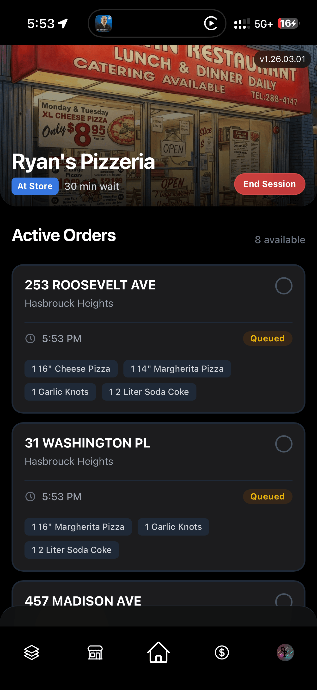
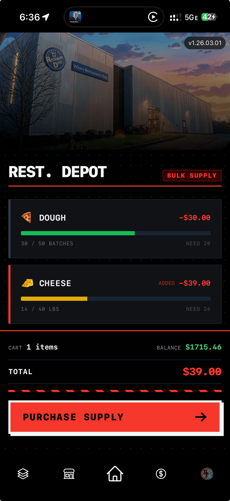
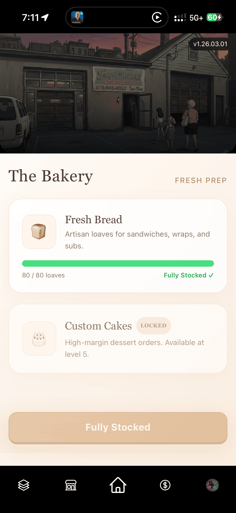
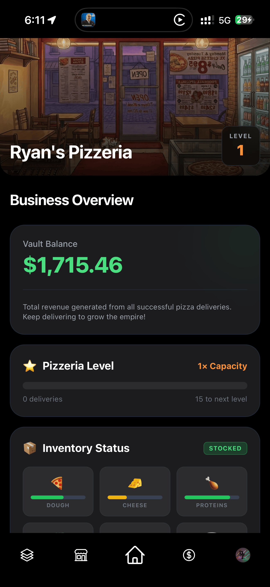
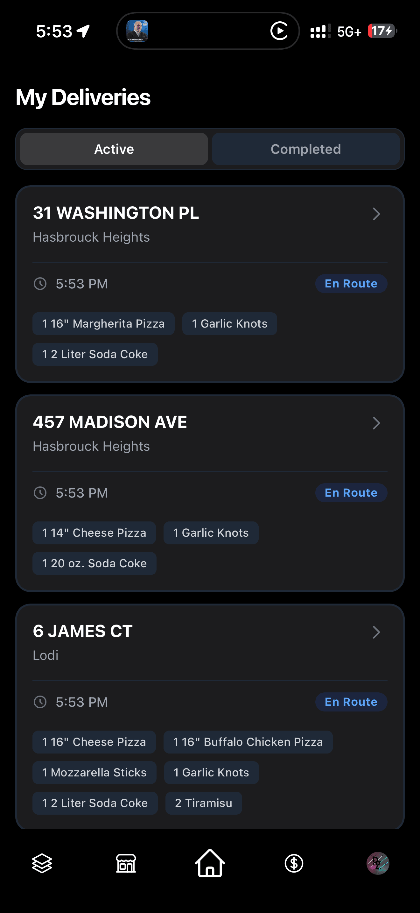
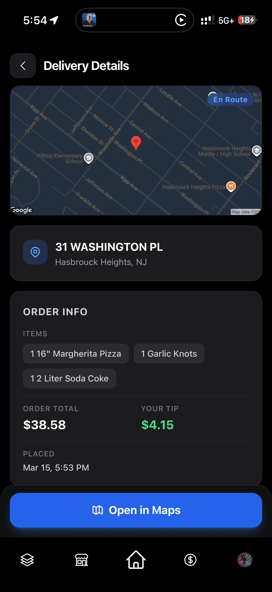
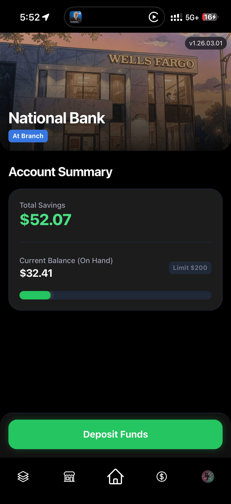
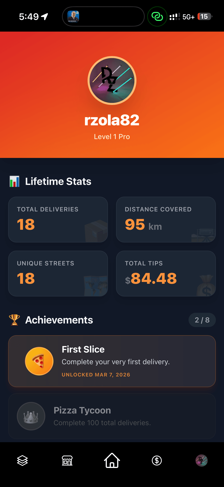

# 🍕 PizzaManGo

**A location-based pizza delivery game.**

A location-based mobile game where you run a pizzeria — deliver orders across real-world neighborhoods, manage ingredient inventory, restock at the depot and bakery, and level up your business.

## How It Works

1. **Start a session** at the pizzeria — orders auto-generate using AI (Gemini)
2. **Pick up deliveries** and navigate to real addresses in your area
3. **Complete deliveries** to earn tips and grow the pizzeria's revenue
4. **Manage resources** — deliveries consume ingredients (dough, cheese, proteins, etc.)
5. **Restock** by physically traveling to the Restaurant Depot or Bakery
6. **Level up** your pizzeria to increase inventory capacity (10 levels, up to 3.5× base)
7. **Bank your earnings** — deposit tips at the bank to protect against the carry limit

## Screenshots

| Home | Depot | Bakery | Pizzeria |
|------|-------|--------|----------|
|  |  |  |  |

| Deliveries | Delivery Detail | Bank | Profile |
|------------|----------------|------|---------|
|  |  |  |  |

## Tech Stack

| Layer | Technology |
|-------|-----------|
| **Frontend** | Vue 3 (Composition API), Vite 4, Tailwind CSS 3 |
| **State** | Vuex 4 + VueFire for real-time Firestore bindings |
| **Backend** | Firebase Cloud Functions (2nd Gen, Node.js 20) |
| **AI** | Google Gemini — generates realistic pizza orders from a real menu |
| **Database** | Cloud Firestore |
| **Auth** | Firebase Authentication (Google Sign-In) |
| **Hosting** | Firebase Hosting |
| **Icons** | Heroicons (Vue) |

## Getting Started

### Prerequisites

- Node.js 21.x
- Firebase CLI (`npm install -g firebase-tools`)
- A Firebase project with Firestore, Auth, and Functions enabled

### Setup

```bash
# Clone the repo
git clone https://github.com/ryanzola/pizza-game.git
cd pizza-game

# Install frontend dependencies
cd services/web
npm install

# Install Cloud Functions dependencies
cd ../../functions
npm install
```

### Environment Variables

Create `services/web/.env.local`:

```env
VITE_FIREBASE_API_KEY=your_firebase_api_key
```

Cloud Functions secrets (set via Firebase CLI):

```bash
firebase functions:secrets:set GOOGLE_API_KEY
firebase functions:secrets:set GEMINI_API_KEY
```

### Development

```bash
# Run the frontend dev server
cd services/web
npm run dev
# → http://localhost:5173
```

### Deployment

```bash
# Deploy Cloud Functions
cd functions
npm run deploy

# Deploy frontend to Firebase Hosting
cd services/web
npm run deploy

# Deploy everything at once (from project root)
firebase deploy
```

## Project Structure

```
pizza/
├── firebase.json              # Firebase config
├── firestore.rules            # Firestore security rules
├── firestore.indexes.json     # Composite indexes
├── functions/
│   ├── index.js               # Cloud Functions (order gen, achievements, restocking)
│   └── data/
│       ├── menu.json          # Full pizzeria menu
│       ├── addresses.json     # Delivery address pool
│       └── resources.json     # Resource config, pricing, level thresholds
└── services/web/
    └── src/
        ├── main.js            # App entry + Firebase auth
        ├── router.js          # Route definitions
        ├── firebase/init.js   # Firebase SDK init
        ├── store/             # Vuex modules (orders, location, inventory, achievements)
        ├── views/             # Pages (Home, Pizzeria, Deliveries, Bank, etc.)
        │   └── locations/     # Location-specific UIs (Depot, Bakery, Pizzeria)
        └── components/        # Shared components (Navbar, Order, Achievement)
```

## Game Systems

### 📦 Resource Management
Nine ingredient categories mapped from the real menu. Orders consume resources on generation. When stock hits zero, new orders are blocked until the driver restocks.

| Resource | Restock Location |
|----------|-----------------|
| Dough, Cheese, Proteins, Produce, Pasta, Fry Oil, Beverages, Desserts | Restaurant Depot |
| Bread | The Bakery |

### ⭐ Pizzeria Leveling
| Level | Deliveries | Capacity |
|-------|-----------|----------|
| 1 | 0 | 1.0× |
| 5 | 100 | 1.75× |
| 10 | 500 | 3.5× |

### 💰 Economy
- **Pizzeria vault** — accumulates delivery revenue, spent on restocking
- **Driver wallet** — earns tips, can deposit at the bank
- Restocking costs ~60% of ingredient revenue, keeping margins tight

## Firebase Project

- **Project ID**: `pizzamango-376923`
- **Hosting**: [pizzamango-376923.web.app](https://pizzamango-376923.web.app)

## License

Private project. All rights reserved.
